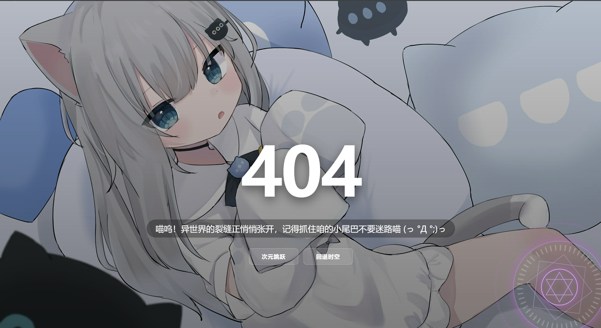

# 🌌 魔法 404 页面

[English](./README.md) | [简体中文](./README_zh.md)

**一个充满魔力的 404 错误页面，结合了动态二次元背景与可交互的魔法阵特效。**

[✨ 点击查看在线演示](https://mariohy.github.io/404-page/404.html) · [🐞 反馈问题](https://github.com/MarioHY/404-page/issues)

---

## 📸 预览图

## ✨ 特性

* **动态随机壁纸**：默认接入作者专属接口 `acgapi.dpdns.org`，提供随机二次元图片背景。
* **交互式魔法阵**：右下角魔法阵，悬停展开，点击触发“魔力注入”加载动画。
* **响应式设计**：适配 PC 端与移动端，优化了魔法阵尺寸。

## 🚀 快速开始

只需将本项目中的 `404.html` 内容复制到你项目的 404 错误页面中即可。

### 魔法来源 (API 说明)

> **因果律重置**：点击魔法阵可触发魔力激荡，重新抽取当前背景。

* **API 地址**: `https://acgapi.dpdns.org`
* **原理**: 通过在 URL 后添加时间戳 `?t=${Date.now()}` 强制浏览器刷新缓存，实现即刻切换背景。

## ✍️ 关于作者

* **MarioHY** - [GitHub 主页](https://github.com/MarioHY)
* **API 服务**: [acgapi.dpdns.org](https://acgapi.dpdns.org)

## 📜 许可说明

本项目采用 **CC BY-NC-SA 4.0** 许可协议。

1. **严禁商用**：不得将本项目代码用于任何盈利性质的网站或服务。
2. **署名要求**：二次分发或修改使用需保留原作者的署名信息。
3. **相同方式共享**：基于本项目的演绎作品必须采用相同的许可协议分发。
